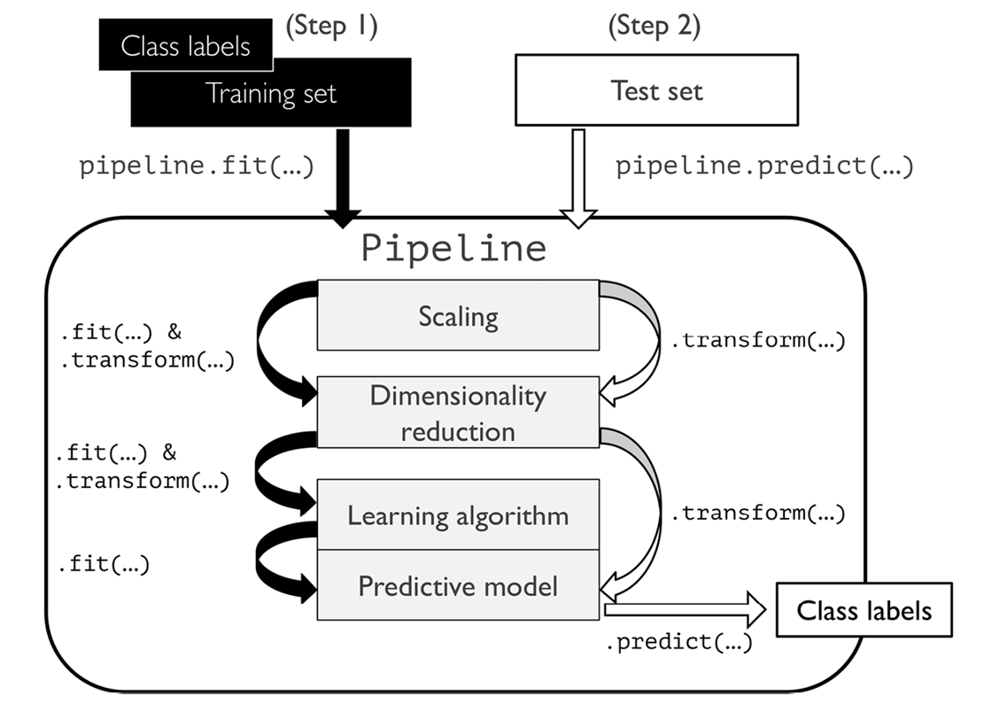

How the pipeline works:

The make_pipeline function takes an arbitrary number of scikit-learn transformers (objects that support the fit and transform methods as input), followed by a scikit-learn estimator that implements the fit and predict methods. In our preceding code example, we provided two scikit-learn transformers, StandardScaler and PCA, and a LogisticRegression estimator as inputs to the make_pipeline function, which constructs a scikit-learn Pipeline object from these objects.
    We can think of a scikit-learn Pipeline as a meta-estimator or wrapper around those individual transformers and estimators. If we call the fit method of Pipeline, the data will be passed down a series of transformers via fit and transform calls on these intermediate steps until it arrives at the estimator object (the final element in a pipeline). The estimator will then be fitted to the transformed training data.
    When we executed the fit method on the pipe_lr pipeline in the preceding code example, StandardScaler first performed fit and transform calls on the training data. Second, the transformed training data was passed on to the next object in the pipeline, PCA. Similar to the previous step, PCA also executed fit and transform on the scaled input data and passed it to the final element of the pipeline, the estimator.
    Finally, the LogisticRegression estimator was fit to the training data after it underwent transformations via StandardScaler and PCA. Again, we should note that there is no limit to the number of intermediate steps in a pipeline; however, if we want to use the pipeline for prediction tasks, the last pipeline element has to be an estimator.
    Similar to calling fit on a pipeline, pipelines also implement a predict method if the last step in the pipeline is an estimator. If we feed a dataset to the predict call of a Pipeline object instance, the data will pass through the intermediate steps via transform calls. In the final step, the estimator object will then return a prediction on the transformed data.
    The pipelines of the scikit-learn library are immensely useful wrapper tools that we will use frequently throughout the rest of this book. To make sure that you’ve got a good grasp of how the Pipeline object works, please take a close look at Figure 6.1, which summarizes our discussion from the previous paragraphs: